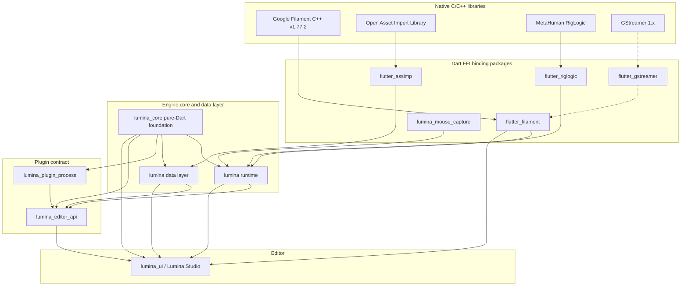

[Türkçe](../../tr/overview/layers.md)

# Layered architecture

Lumina is built bottom-up in strict layers: native C/C++ libraries, Dart FFI binding packages, the engine core and data layer, the plugin contract, and the editor. This page shows the dependency graph and the responsibility of every layer.

## Layer diagram

Every arrow points from a dependency to the package that uses it. Nothing depends on a layer above it.

Dotted arrows are run-time only: `flutter_gstreamer` opens the system GStreamer libraries when it is first used and is needed only for smoke-test evidence: `lumina_smoke` (tools repository), the smoke-test system that `flutter_filament`, `lumina` and `lumina_ui` use, encodes and probes the videos with it.

## Layer responsibilities

1. **`flutter_filament`**: Dart FFI binding to the Google Filament v1.77.2 physically based renderer (Vulkan, OpenGL and Metal on desktop, WebGL2 on the web). It manages engines, scenes, cameras, lights, textures, materials and GPU buffers, and loads glTF through gltfio. Its C wrapper (`src/*_c.cpp`, functions prefixed `filament_*`) is compiled by the package's native-assets hook.
2. **`flutter_assimp`** (tools repository): Dart FFI binding to the Open Asset Import Library. It converts more than 40 external 3D formats (FBX, OBJ, DAE, STL, Blend and others) into binary glTF 2.0 (`.glb`), on disk or in memory.
3. **`flutter_riglogic`** (tools repository): Dart FFI binding to MetaHuman RigLogic. It reads DNA files and evaluates PSDs, RBFs, joint transforms and blend shape weights for facial rigs.
4. **`flutter_gstreamer`**, **`lumina_smoke`** and **`lumina_mouse_capture`** (tools repository): video encoding, the smoke-test system (artifacts, video checks and the report runner), and pointer capture for games and Play-In-Editor.
5. **`lumina_core`**: the pure-Dart foundation every layer above shares: math (units, axes, Euler), the file formats (`.lmas`, `.lmproject`, levels, `.lmplugin`, landscape, sequencer, themes) and their level and plugin repositories, the engine logger, workspace and data paths, and pure tooling services (build fingerprint and cache, glTF packer, TGA decoder, primitive GLB factory, templates). No Flutter, `dart:ui` or FFI, so plugin processes and command-line tools can use it with `dart run`. See [lumina_core](../lumina_core/index.md).
6. **`lumina`**: the engine. The runtime half (`lib/src/`) is the declarative element tree (`build()`), the actor hierarchy (`LuminaActor`, `LuminaPawn`, `LuminaCharacter`), physics and collision (GJK/EPA), AI (behavior trees, navigation), skeletal animation blending, spatial audio and action-based input. The data half (`lib/data/`, `lib/domain/`) holds the editor services that need the engine or native libraries: the asset and project repositories, the GLB and OBJ parsers, importers, thumbnails and the Dart code generator. It re-exports `lumina_core`.
7. **`lumina_plugin_process`** and **`lumina_editor_api`**: the plugin contract. `lumina_plugin_process` is the pure-Dart process side of a plugin (the process API and runtime, the level, storage and MCP data types, `lumina_core`'s change types and a loopback test host; no Flutter), see [lumina_plugin_process](../lumina_plugin_process/index.md). `lumina_editor_api` is the lightweight plugin API that defines commands, toolbar buttons, panels, importers and details customizations; it re-exports `lumina_plugin_process` with Flutter adapters and depends on no editor code, which breaks the dependency cycle between the editor and its plugins.
8. **`lumina_ui`**: Lumina Studio, the desktop editor built with `shadcn_flutter`: 3D viewport, outliner, details inspector, content browser, output log and the asset sub-editors. New 3D features go through `lumina`; the viewports also use `flutter_filament` directly.

## Web builds

`flutter_filament` also builds as one WebAssembly module (Filament's WebGL2 backend plus the same C wrapper), so the same `filament_*` functions exist on the web. On the Dart side every wrapper imports the package's platform shims instead of `dart:ffi`, which resolve to a `dart:ffi`-compatible layer over the WebAssembly heap in the browser. Generated games import `package:lumina/lumina_runtime.dart`, which leaves out everything that cannot run in a browser.

---

[Previous: What is Lumina](what-is-lumina.md) | [Up: Lumina documentation](../../README.md) | [Next: Repository map](repositories.md)
