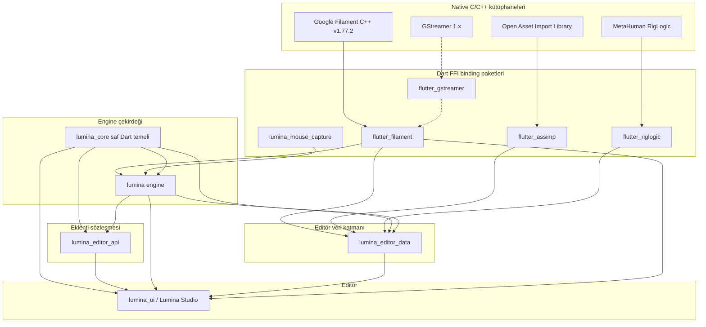

[English](../../en/overview/layers.md)

# Katmanlı mimari

Lumina, aşağıdan yukarıya katı katmanlarla kurulur: native C/C++ kütüphaneleri, Dart FFI binding paketleri, engine çekirdeği, editör veri katmanı, eklenti sözleşmesi ve editör. Bu sayfa bağımlılık grafiğini ve her katmanın sorumluluğunu gösterir.

## Katman diyagramı

Her ok, bir bağımlılıktan onu kullanan pakete doğru çizilmiştir. Hiçbir şey kendisinden yukarıdaki bir katmana bağımlı değildir.

Noktalı oklar yalnızca çalışma anına aittir: `flutter_gstreamer` sistemdeki GStreamer kütüphanelerini ilk kullanıldığında açar ve yalnızca smoke test kanıtları için gereklidir: `flutter_filament`, `lumina` ve `lumina_ui` paketlerinin kullandığı smoke test sistemi `lumina_smoke` (tools repository'si), videoları onunla encode ve probe eder.

## Katmanların sorumlulukları

1. **`flutter_filament`**: Google Filament v1.77.2 fiziksel tabanlı renderer'ının Dart FFI binding'i (masaüstünde Vulkan, OpenGL ve Metal, web'de WebGL2). Engine'leri, sahneleri, kameraları, ışıkları, texture'ları, materyalleri ve GPU buffer'larını yönetir, glTF'i gltfio ile yükler. C wrapper'ı (`src/*_c.cpp`, `filament_*` önekli fonksiyonlar) paketin native-assets hook'u tarafından derlenir.
2. **`flutter_assimp`** (tools repository'si): Open Asset Import Library'nin Dart FFI binding'i. FBX, OBJ, DAE, STL, Blend gibi 40'tan fazla harici 3D formatı diskte ya da bellekte binary glTF 2.0'a (`.glb`) dönüştürür.
3. **`flutter_riglogic`** (tools repository'si): MetaHuman RigLogic'in Dart FFI binding'i. DNA dosyalarını okur ve yüz rig'leri için PSD'leri, RBF'leri, joint transform'larını ve blend shape ağırlıklarını hesaplar.
4. **`flutter_gstreamer`**, **`lumina_smoke`** ve **`lumina_mouse_capture`** (tools repository'si): video encode, smoke test sistemi (artifact'ler, video kontrolleri ve rapor çalıştırıcısı) ve oyunlar ile Play-In-Editor için pointer capture.
5. **`lumina_core`**: üstteki her katmanın paylaştığı saf Dart temeli: matematik (birimler, eksenler, Euler), dosya formatları (`.lmas`, `.lmproject`, level'lar, `.lmplugin`, landscape, sequencer, temalar) ve level ile eklenti repository'leri, engine logger, çalışma alanı ve veri yolları ve saf araç servisleri (build parmak izi ve önbelleği, glTF paketleyici, TGA çözücü, primitive GLB fabrikası, şablonlar). Flutter, `dart:ui` ya da FFI içermez; eklenti süreçleri ve komut satırı araçları onu `dart run` ile kullanabilir. Bkz. [lumina_core](../lumina_core/index.md).
6. **`lumina`**: engine (`lib/src/`): deklaratif element ağacı (`build()`), actor hiyerarşisi (`LuminaActor`, `LuminaPawn`, `LuminaCharacter`), fizik ve çarpışma (GJK/EPA), yapay zeka (behavior tree'ler, navigasyon), iskelet animasyonu harmanlama, uzamsal ses, action tabanlı input ve çalışan bir oyunun kullandığı asset okuyucuları (Filament'in Draco çözücüsüyle GLB yükleyici, level asset manifestosu). `lumina_core`'u yeniden export eder ve hiçbir editör aracına ulaşmaz.
7. **`lumina_editor_data`**: engine dışındaki editör veri katmanı: asset, proje ve koleksiyon repository'leri, içe aktarıcılar (Assimp FBX/OBJ, GLB içe aktarma temizleyicisi), thumbnail'lar, Dart ve Blueprint kod üreteçleri, proje editörü host üreteci ve build servisi, eklenti registry'si ve şablon üreteci, derived data cache, import kuyruğu ve use case'ler. `lumina`, `flutter_assimp` ve `flutter_riglogic`'e bağımlıdır; editör kodunun import ettiği `lumina_editor.dart` şemsiye kütüphanesi buradadır. Bkz. [lumina_editor_data](../lumina_editor_data/index.md).
8. **`lumina_editor_api`**: komutları, toolbar butonlarını, panelleri, importer'ları ve details özelleştirmelerini tanımlayan hafif bir eklenti API'si. Yalnızca `lumina`'ya bağımlıdır; böylece editör ile eklentileri arasındaki bağımlılık döngüsünü kırar.
9. **`lumina_ui`**: `shadcn_flutter` ile geliştirilmiş masaüstü editör Lumina Studio: 3D viewport, outliner, details inspector, content browser, output log ve asset alt editörleri. Yeni 3D özellikleri `lumina` üzerinden geçer; viewport'lar ayrıca `flutter_filament`'i doğrudan kullanır.

## Web build'leri

`flutter_filament` tek bir WebAssembly modülü olarak da build edilir (Filament'in WebGL2 backend'i ve aynı C wrapper'ı); böylece aynı `filament_*` fonksiyonları web'de de vardır. Dart tarafında her wrapper `dart:ffi` yerine paketin platform shim'lerini import eder; bunlar tarayıcıda WebAssembly heap'i üzerinde çalışan, `dart:ffi` uyumlu bir katmana çözülür. Üretilen oyunlar, tarayıcıda çalışamayan her şeyi dışarıda bırakan `package:lumina/lumina_runtime.dart`'ı import eder.

---

[Önceki: Lumina nedir](what-is-lumina.md) | [Üst: Lumina dokümantasyonu](../../README.tr.md) | [Sonraki: Repository haritası](repositories.md)
